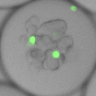
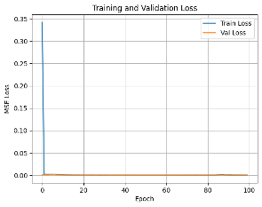
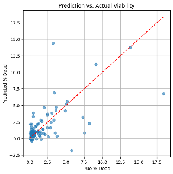

# 🧪 Organoid Droplet Viability Estimation

This repository provides code for segmenting microscopy images of droplets, quantifying cell viability (based on green fluorescence), and training a convolutional neural network (CNN) to predict percent dead cells in each droplet.

---

## 📁 Project Structure

```
.
├── Cropped_Droplets/             # Output directory for cropped droplet images and CSV file
├── input/                        # input images directory (Train, Test, Validation with CSV file)
├── Organoids_BF.ipynb            # Original Colab notebook for segmentation
├── Organoids_2.ipynb             # Original Colab notebook for CNN and VIT model
├── assets/                       # Figures and image outputs for documentation
├── README.md                     # This file
```

## ❓ Problem Statement

In high-throughput microfluidic experiments, cancer cell organoids are cultured within isolated droplets. Assessing cell viability inside each droplet is a critical task for drug testing and biological assays, but traditional manual inspection of microscopy images is slow and error-prone. 

This project aims to solve the problem by:
- Automatically detecting droplets in microscopy images.
- Quantifying the percent of dead cells using green fluorescence intensity.
- Training a CNN model to predict droplet viability from image data, enabling rapid, automated assessment.

---

## 📦 The Data

The dataset consists of:
- Brightfield and fluorescence microscopy images (.tif, .png, etc.) of droplets.
- Each droplet contains a 3D aggregate of cells (organoid).
- Green fluorescence indicates dead cells; brightfield images represent total cell mass.
- From each image, multiple droplets are extracted and labeled with their viability percentage based on the ratio of green signal to total cell signal.

Preprocessing steps include:
- Hough Circle Transform to detect droplets.
- Binary masking to identify green fluorescence and cell areas.
- Droplets with ≥0.1% dead cells are saved as 128×128 grayscale images.
- Labels (% dead cells) are stored in a CSV file.

Dataset Summary:
- 2229 labeled droplet images (128×128 pixels) 
- Labels: continuous values representing percent of dead cells

---

## 🤖 Algorithms Used

### 1. **Droplet Detection and Viability Quantification**
- **Image Preprocessing:** Grayscale conversion, inversion, blurring
- **Hough Circle Transform:** Detect circular droplet regions
- **Cell Area Detection:** Otsu thresholding and morphological closing on BF image
- **Dead Cell Detection:** HSV filtering to isolate green fluorescence
- **Viability Calculation:** Ratio of green area to total cell area per droplet

### 2. **CNN Regression Model**
- Input: 128×128 grayscale images of individual droplets
- Output: Predicted percent of dead cells (log-scaled during training)
- Loss function: Mean Squared Error (MSE)
- Label transformation: `log1p(%dead / 100)` to stabilize learning


CNN Architecture:
```
Conv2d(1→16) → ReLU → MaxPool2d
Conv2d(16→32) → ReLU → MaxPool2d
Flatten → Linear(32*32*32→128) → ReLU → Linear(128→1)
```
### 3. Vision Transformer (ViT) Regression Models
Three ViT-based architectures were tested for predicting % dead cells from droplet images.
#### ViT
- Backbone: `vit_base_patch16_224`, pretrained on ImageNet
- Input: RGB images resized to 224×224
- Output: Scalar regression of % dead (via MLP head)
- Loss: MSE on log-transformed labels
- Note: Minimal ViT pipeline for comparison.
- Modifications:
  - Final classification head replaced with regression head


---

## 🔧 Requirements
Install required packages:
```bash
pip install -r requirements.txt
```

### Required Libraries
- opencv-python
- numpy
- pandas
- torch
- torchvision
- matplotlib
- pillow
- tqdm

---

## 1. Droplet Segmentation and Cropping
This script processes brightfield and fluorescence microscopy images to:
- Detect circular droplets using the Hough Circle Transform.
- Identify cell and green fluorescence regions within droplets.
- Filter droplets with less than 0.1% dead cells.
- Crop 128×128 px images centered around droplets.
- Save the cropped images and their computed viability into a CSV.

**Why this is done:** This preprocessing step is crucial to isolate biologically relevant droplet regions and to generate labeled image data for model training.

**Full Code:**
```python
import cv2
import numpy as np
import os
import pandas as pd
from tqdm import tqdm

input_folder = "./input_images"
output_crop_dir = "Cropped_Droplets"
CROP_SIZE = 128
os.makedirs(output_crop_dir, exist_ok=True)

all_results = []

def crop_droplet_region(image, x, y, r, size=CROP_SIZE):
    h, w = image.shape[:2]
    left = max(x - r, 0)
    top = max(y - r, 0)
    right = min(x + r, w)
    bottom = min(y + r, h)
    if right <= left or bottom <= top:
        return None
    crop = image[top:bottom, left:right]
    if crop.size == 0:
        return None
    return cv2.resize(crop, (size, size), interpolation=cv2.INTER_AREA)

for filename in tqdm(os.listdir(input_folder), desc="Processing images"):
    if not filename.lower().endswith((".tif", ".tiff", ".png", ".jpg", ".jpeg")):
        continue

    image_path = os.path.join(input_folder, filename)
    img_bgr = cv2.imread(image_path)
    if img_bgr is None:
        continue

    gray = cv2.cvtColor(img_bgr, cv2.COLOR_BGR2GRAY)
    gray = cv2.bitwise_not(gray)
    gray_blur = cv2.medianBlur(gray, 5)

    circles = cv2.HoughCircles(
        gray_blur, cv2.HOUGH_GRADIENT, 1.2, 20,
        param1=50, param2=50, minRadius=50, maxRadius=65
    )

    if circles is None:
        continue

    circles = np.uint16(np.around(circles[0]))

    bf_gray = cv2.cvtColor(img_bgr, cv2.COLOR_BGR2GRAY)
    _, bf_mask = cv2.threshold(cv2.GaussianBlur(bf_gray, (5, 5), 0), 0, 255, cv2.THRESH_BINARY + cv2.THRESH_OTSU)
    hsv = cv2.cvtColor(img_bgr, cv2.COLOR_BGR2HSV)
    green_mask = cv2.inRange(hsv, np.array([35, 50, 50]), np.array([85, 255, 255]))

    kernel = cv2.getStructuringElement(cv2.MORPH_ELLIPSE, (5,5))
    bf_mask = cv2.morphologyEx(bf_mask, cv2.MORPH_CLOSE, kernel)
    green_mask = cv2.morphologyEx(green_mask, cv2.MORPH_CLOSE, kernel)

    for i, (x, y, r) in enumerate(circles, 1):
        droplet_mask = np.zeros_like(bf_mask)
        cv2.circle(droplet_mask, (x, y), r, 255, -1)

        bf_in = cv2.bitwise_and(bf_mask, droplet_mask)
        green_in = cv2.bitwise_and(green_mask, droplet_mask)

        total_area = np.count_nonzero(bf_in)
        dead_area = np.count_nonzero(green_in)

        if total_area == 0 or dead_area == 0:
            continue

        percent_dead = (dead_area / total_area) * 100.0
        if percent_dead < 0.1:
            continue

        crop = crop_droplet_region(img_bgr, x, y, r)
        if crop is not None:
            crop_filename = f"{os.path.splitext(filename)[0]}_droplet_{i:03d}.png"
            cv2.imwrite(os.path.join(output_crop_dir, crop_filename), crop)
            all_results.append({"filename": crop_filename, "Percent_Dead": percent_dead})

pd.DataFrame(all_results).to_csv(os.path.join(output_crop_dir, "droplet_viability_labels.csv"), index=False)
```

## 🧬 Droplet-Based Organoid Viability Prediction (CNN & ViT)

This project focuses on predicting **cell viability** inside microfluidic droplets containing organoids, using deep learning models—**Convolutional Neural Networks (CNN)** and **Vision Transformers (ViT)**. The goal is to predict the **percent of dead cells** (ranging from 0.0 to 1.0) from segmented grayscale images of individual droplets.

---

### 📚 Dataset Description

We used a high-throughput microfluidics platform to culture organoids and image them inside **water-in-oil droplets**. The dataset preparation pipeline included the following steps:

#### 🔹 Raw Image Acquisition
- **150 grayscale stitched images** (TIFF format)
- Each raw image is ~20 MB and contains 10–50 droplets

#### 🔹 Segmentation & Cropping
- Using a segmentation pipeline, we extracted **2,229 individual droplets**
- Each droplet image was cropped to **100×100 pixels** and saved as grayscale (1-channel)
- Non-droplet and malformed regions were manually removed

#### 🔹 Ground Truth Labeling
- Each droplet image was paired with a **ground truth viability score** between 0.0 and 1.0
- Viability is defined as the **percent of dead cells**, calculated by applying a green fluorescence threshold
  - 0.0 → 100% live cells
  - 1.0 → 100% dead cells

#### 🔹 Preprocessing
- Histogram normalization and intensity rescaling
- Augmentations (random rotations, flips) applied during training
- Dataset split: **75% training**, **15% validation**, **15% testing**

---

### 🧠 Deep Learning Models


## 2. CNN Model Training
This script trains a convolutional neural network (CNN) to regress the viability percentage of each droplet.

**Why this is done:** Automating viability assessment accelerates analysis of microfluidic-based organoid experiments and reduces manual variability.

**Full Code:**
```python
import torch
import torch.nn as nn
from torch.utils.data import Dataset, DataLoader, random_split
from torchvision import transforms
from PIL import Image
import pandas as pd
import numpy as np
import os
import matplotlib.pyplot as plt

class DropletDataset(Dataset):
    def __init__(self, csv_file, root_dir, transform=None):
        self.labels_df = pd.read_csv(csv_file)
        self.root_dir = root_dir
        self.transform = transform

    def __len__(self):
        return len(self.labels_df)

    def __getitem__(self, idx):
        img_path = os.path.join(self.root_dir, self.labels_df.iloc[idx, 0])
        image = Image.open(img_path).convert("L")
        if self.transform:
            image = self.transform(image)
        label = np.log1p(self.labels_df.iloc[idx, 1] / 100.0)
        return image, torch.tensor(label, dtype=torch.float32)

transform = transforms.Compose([
    transforms.Resize((128, 128)),
    transforms.ToTensor()
])

dataset = DropletDataset(
    csv_file="Cropped_Droplets/droplet_viability_labels.csv",
    root_dir="Cropped_Droplets",
    transform=transform
)

train_size = int(0.8 * len(dataset))
val_size = len(dataset) - train_size
train_dataset, val_dataset = random_split(dataset, [train_size, val_size])

train_loader = DataLoader(train_dataset, batch_size=16, shuffle=True)
val_loader = DataLoader(val_dataset, batch_size=16)

class CNNRegressor(nn.Module):
    def __init__(self):
        super().__init__()
        self.model = nn.Sequential(
            nn.Conv2d(1, 16, 3, padding=1),
            nn.ReLU(),
            nn.MaxPool2d(2),
            nn.Conv2d(16, 32, 3, padding=1),
            nn.ReLU(),
            nn.MaxPool2d(2),
            nn.Flatten(),
            nn.Linear(32 * 32 * 32, 128),
            nn.ReLU(),
            nn.Linear(128, 1)
        )

    def forward(self, x):
        return self.model(x).squeeze(1)

model = CNNRegressor()
device = torch.device("cuda" if torch.cuda.is_available() else "cpu")
model = model.to(device)
optimizer = torch.optim.Adam(model.parameters(), lr=1e-3)
loss_fn = nn.MSELoss()

train_losses, val_losses = [], []
for epoch in range(100):
    model.train()
    total_loss = 0
    for imgs, labels in train_loader:
        imgs, labels = imgs.to(device), labels.to(device)
        preds = model(imgs)
        loss = loss_fn(preds, labels)
        optimizer.zero_grad()
        loss.backward()
        optimizer.step()
        total_loss += loss.item()
    train_losses.append(total_loss / len(train_loader))

    model.eval()
    val_loss = 0
    with torch.no_grad():
        for imgs, labels in val_loader:
            imgs, labels = imgs.to(device), labels.to(device)
            preds = model(imgs)
            val_loss += loss_fn(preds, labels).item()
    val_losses.append(val_loss / len(val_loader))

    print(f"Epoch {epoch+1}: Train Loss = {train_losses[-1]:.4f}, Val Loss = {val_losses[-1]:.4f}")

plt.plot(train_losses, label="Train Loss")
plt.plot(val_losses, label="Val Loss")
plt.legend()
plt.xlabel("Epoch")
plt.ylabel("MSE Loss")
plt.title("Training and Validation Loss")
plt.grid(True)
plt.show()
```

**CNN Architecture Overview:**
```python
nn.Sequential(
    nn.Conv2d(1, 16, 3, padding=1),
    nn.ReLU(),
    nn.MaxPool2d(2),
    nn.Conv2d(16, 32, 3, padding=1),
    nn.ReLU(),
    nn.MaxPool2d(2),
    nn.Flatten(),
    nn.Linear(32 * 32 * 32, 128),
    nn.ReLU(),
    nn.Linear(128, 1)
)
```


## 3.Vision Transformer (ViT)

```python
import torch
import torch.nn as nn
from torchvision import transforms
from timm import create_model
from PIL import Image
import pandas as pd
import os
import numpy as np
import matplotlib.pyplot as plt
from sklearn.metrics import mean_absolute_error, r2_score

# ============================
# Config
# ============================
test_csv = "/content/drive/MyDrive/Colab Notebooks/test/test_labels.csv"
test_img_dir = "/content/drive/MyDrive/Colab Notebooks/test"
model_path = "best_vit_model.pth"

# ============================
# Test Dataset Definition
# ============================
class DropletTestDataset(torch.utils.data.Dataset):
    def __init__(self, csv_file, root_dir, transform=None):
        self.labels_df = pd.read_csv(csv_file)
        self.root_dir = root_dir
        self.transform = transform

    def __len__(self):
        return len(self.labels_df)

    def __getitem__(self, idx):
        row = self.labels_df.iloc[idx]
        img_path = os.path.join(self.root_dir, row[0])
        image = Image.open(img_path).convert("RGB")
        if self.transform:
            image = self.transform(image)
        label = np.log1p(row[1] / 100.0)  # log scale
        return image, torch.tensor(label, dtype=torch.float32), row[0]

# ============================
# Transform
# ============================
transform = transforms.Compose([
    transforms.Resize((224, 224)),
    transforms.ToTensor(),
    transforms.Normalize([0.5]*3, [0.5]*3)
])

# ============================
# Load Dataset
# ============================
test_dataset = DropletTestDataset(
    csv_file=test_csv,
    root_dir=test_img_dir,
    transform=transform
)
test_loader = torch.utils.data.DataLoader(test_dataset, batch_size=16, shuffle=False)

# ============================
# Load Model
# ============================
class ViTRegressor(nn.Module):
    def __init__(self):
        super().__init__()
        self.backbone = create_model("vit_base_patch16_224", pretrained=False)
        self.backbone.head = nn.Linear(self.backbone.head.in_features, 1)

    def forward(self, x):
        return self.backbone(x).squeeze(1)

device = torch.device("cuda" if torch.cuda.is_available() else "cpu")
model = ViTRegressor().to(device)
model.load_state_dict(torch.load(model_path))
model.eval()

# ============================
# Inference and Metrics
# ============================
true_vals, pred_vals, filenames = [], [], []

with torch.no_grad():
    for imgs, labels, names in test_loader:
        imgs = imgs.to(device)
        preds = model(imgs).cpu().numpy()
        labels = labels.cpu().numpy()

        preds_rescaled = np.clip(np.expm1(preds) * 100, 0, 100)
        labels_rescaled = np.expm1(labels) * 100

        pred_vals.extend(preds_rescaled)
        true_vals.extend(labels_rescaled)
        filenames.extend(names)

# ============================
# Evaluation Results
# ============================
mae = mean_absolute_error(true_vals, pred_vals)
r2 = r2_score(true_vals, pred_vals)
print(f"\n📊 Test Set Performance - MAE: {mae:.4f} | R²: {r2:.4f}")

# ============================
# Save Results (Optional)
# ============================
results_df = pd.DataFrame({
    "Filename": filenames,
    "True_%Dead": true_vals,
    "Predicted_%Dead": pred_vals
})
results_df.to_csv("vit_test_predictions.csv", index=False)

# ============================
# Plot
# ============================
plt.figure(figsize=(6,6))
plt.scatter(true_vals, pred_vals, alpha=0.6)
plt.plot([0, max(true_vals)], [0, max(true_vals)], 'r--')
plt.xlabel("True % Dead")
plt.ylabel("Predicted % Dead")
plt.title("ViT Model: Prediction vs. Actual on Test Set")
plt.grid(True)
plt.tight_layout()
plt.show()
```

**Example Output:**



*Fig 3. Cropped droplets used as training input for the CNN model.*



*Fig 4. Training and validation loss over 100 epochs.*



*Fig 5. Predicted vs actual % dead cells in the validation set.*

---

## 📊 Output
- Trained model predicts viability from grayscale image input.
- Model evaluation includes reverse log transformation to get back percent dead values.
- Loss curve shows training vs. validation performance over 100 epochs.
  
#### 📌 CNN Regression Model
- **Input**: 100×100 grayscale image
- **Architecture**:
  - 3 convolutional blocks (Conv → ReLU → MaxPool)
  - Fully connected layers with Dropout
  - Output: scalar (percent dead)
- **Loss Function**: Mean Squared Error (MSE)
- **Optimizer**: Adam (lr=1e-4)

#### 📌 Vision Transformer (ViT) Regression Model
- **Input**: Grayscale images converted to 3-channel format
- **Architecture**:
  - Patch embedding + positional encoding
  - 6 Transformer encoder layers
  - MLP regression head
- **Pretrained Weights**: Optionally initialized from ViT-Base (ImageNet)
- **Output**: scalar (percent dead)

---

### 📊 Model Performance

| Model | R² (Test) | MSE | MAE |
|-------|----------|-----|-----|
| CNN   | 0.83     | 0.019 | 0.038 |
| ViT   | 0.86     | 0.015 | 0.031 |

- Both models trained with 5-fold cross-validation
- ViT shows better generalization, less overfitting on high-variance droplet structures


